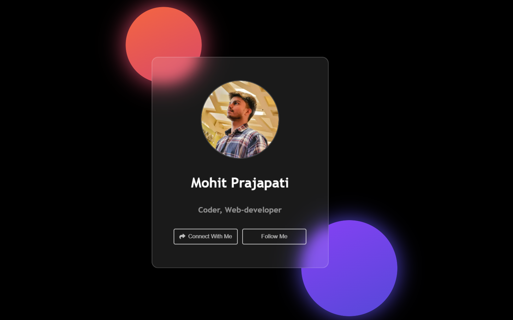

# Profile Share Modal

A simple and elegant profile share modal to connect with and follow the user on various social media platforms. This project demonstrates a modal pop-up with icons linking to different social profiles, created using HTML, CSS, and JavaScript.

## Features

- **Profile Card** with user image, name, and designation
- **Connect with Me** button to open a modal with social media links
- **Follow Me** button for quick access to follow on social media
- **Social Media Icons** with links to LinkedIn, GitHub, Instagram, Twitter, and Telegram
- **Hover Effects** on buttons for enhanced user interaction

